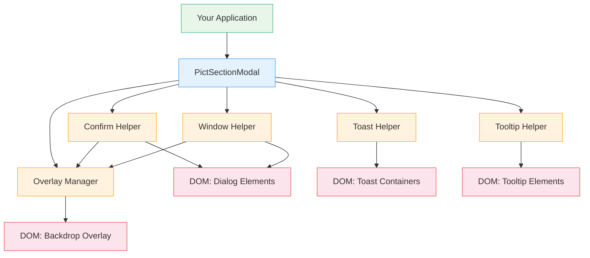

# Pict-Section-Modal

A modal dialog, confirmation, tooltip, and toast notification section view for the [Pict](https://github.com/stevenvelozo/pict) application framework. Drop in a single view to get promise-based confirmations, custom floating windows, auto-dismissing toasts, and hover tooltips — all styled through CSS custom properties.

Pict-Section-Modal provides a complete notification and dialog toolkit — confirm dialogs, double-confirm safety gates, custom modal windows with arbitrary content, toast notifications with stacking, and simple or rich interactive tooltips — all composable through the Fable service provider pattern.

## What It Does

Pict-Section-Modal gives your Pict application a unified API for user-facing dialogs and notifications:

- **Ask for confirmation** before destructive operations with single or double-confirm flows
- **Show modal windows** with arbitrary HTML content and configurable action buttons
- **Display toast notifications** that stack, auto-dismiss, and support four severity levels
- **Attach tooltips** to any element with directional positioning and viewport-aware auto-flip
- **Theme everything** with CSS custom properties — no source code changes required

All methods return promises or handles, so dialog results integrate naturally with async application logic. The view registers with Pict's service provider system and manages its own DOM lifecycle — creating, animating, and removing elements as needed.

## Architecture at a Glance



The main `PictSectionModal` class extends `pict-view` and delegates to five internal helper classes. Each helper manages a specific UI concern while sharing a common overlay and tracking infrastructure.

## Key Concepts

### Shared Overlay

Confirm dialogs and modal windows share a single backdrop overlay element. The overlay is reference-counted — it appears when the first modal opens and disappears when the last one closes. Clicking the overlay dismisses the topmost modal (configurable via `OverlayClickDismisses`).

### Promise-Based API

`confirm()`, `doubleConfirm()`, and `show()` all return Promises. A confirmation resolves to `true` or `false`. A modal window resolves to the clicked button's `Hash` string, or `null` if closed without selecting an action. This makes it straightforward to use `await` in your application logic.

### CSS Custom Properties

All visual styling flows through `--pict-modal-*` custom properties scoped to `.pict-modal-root`. The view automatically adds this class to `document.body` during initialization. Override any variable in your own stylesheet to theme dialogs, toasts, and tooltips without modifying the module.

### DOM Lifecycle

Every dialog, toast, and tooltip follows the same lifecycle: create the DOM element, append to `document.body`, trigger a CSS transition to animate in, and on dismissal reverse the transition before removing from the DOM. This ensures clean, animated user experiences with no orphaned elements.

## Quick Example

```javascript
const libPictSectionModal = require('pict-section-modal');
const libPict = require('pict');

let _Pict = new libPict({ Product: 'ModalDemo' });

_Pict.addView('Modal', {}, libPictSectionModal);
_Pict.initialize();

let tmpModal = _Pict.views.Modal;

// Confirm before deleting
let tmpConfirmed = await tmpModal.confirm('Delete this item?',
	{
		title: 'Delete',
		dangerous: true
	});

if (tmpConfirmed)
{
	// Show success toast
	tmpModal.toast('Item deleted.', { type: 'success' });
}
```

## Learn More

- **[Quick Start](Quick_Start.md)** — Build your first modal dialog in five minutes
- **[Architecture](Architecture.md)** — Helper class design, overlay management, and DOM lifecycle
- **[Implementation Reference](Implementation_Reference.md)** — Complete API surface for every method and configuration option

## Ecosystem

Pict-Section-Modal is part of the [Retold](https://github.com/stevenvelozo/retold) module suite:

- [pict](https://github.com/stevenvelozo/pict) — Core MVC application framework
- [pict-view](https://github.com/stevenvelozo/pict-view) — View base class
- [pict-section-form](https://github.com/stevenvelozo/pict-section-form) — Form sections
- [fable](https://github.com/stevenvelozo/fable) — Service infrastructure and dependency injection

## License

MIT
